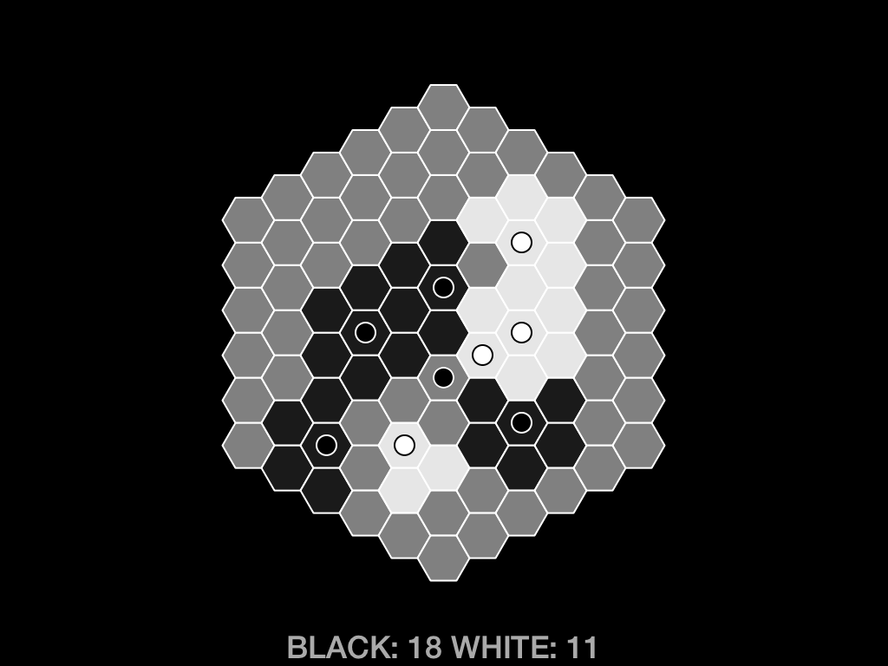

# territory concept game

The time: Thursday afternoon.

The place: Fog Creek's weekly board game night.

The inciting incident: "Hey, I have an idea for a really simple abstract strategy game about territory control."

The outcome: spending an hour making this game instead of playing games.

# The game

The rules are simple: black and white alternate placing stones on a hexagonal board.

Stones exert one influence on their hex and each of its adjacent hexes.

A hex is controlled by whichever player has the most influence on that hex.

You cannot place a stone on a hex that already has a stone on it, and you cannot place a stone on a hex that is owned by your opponent. There are no other placement restrictions.

It's not really clear when the game is over. When all territory is claimed? When the board is full? When both players pass? If passing, is the number of stones on the board taken into account? I'm not sure.

# Is it fun?

I don't know. I didn't really play and tweak it enough to really find out.
